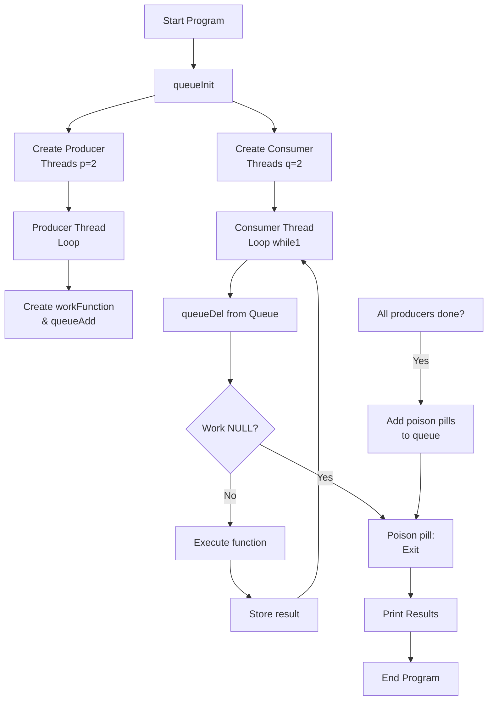

# producer_consumer

## Εισαγωγή

Σε αυτή την εργασία υλοποιούμε ένα κλασικό παράδειγμα **producer** - **consumer**, στο οποίο `p` **producers** δίνουν σε μια κοινή ουρά συναρτήσεις, οι οποίες εκτελούνται από τους `q` **consumers**. 

Οι συναρτήσεις έχουν την εξής δομή:

```
struct workFunction {
  void * (*work)(void *);
  void * arg;
}
```

Στην συγκεκριμένη υλοποίηση επιλέχθηκαν δύο νήματα να εκτελούν την δουλειά των **producer** και άλλα δύο να εκτελούν την δουλειά των **consumer**, διότι η συσκευή στην οποία θα έτρεχε το πρόγραμμα διαθέτει στο μέγιστο τέσσερα νήματα για παράλληλο προγραμματισμό.

## Workflow

Οι εντολές που πρέπει να εκτελεστούν για να δουλέψει αυτό το πρόγραμμα έχουν μια προκαθορισμένη σειρά. Για να εκτελεστεί σωστά το πρόγραμμα χρειαζόμαστε δύο `mutexes` και δύο `condition variables`, τα οποία πρέπει να αρχικοποιηθούν πριν τα χρησιμοποιήσουμε. Αυτή η αρχικοποίηση γίνεται στην αρχή του προγράμματος με την εντολή `queueInit(&q)`.

Στην συνέχεια δημιουργούμε τον επιθυμητό αριθμό από `producer threads` και από `consumer threads` και κάνουμε `pthreadjoin()` τα νήματα που δημιουργήσαμε περιμένοντας να ολοκληρωθεί η εκτέλεσή τους. 

Τα `producer threads` εκτελούν παράλληλα την συνάρτηση `void *producer(void *arg)` η οποία δημιουργεί `JOBS_PER_PRODUCER` σε αριθμό δουλειές και τις προσθέτει στην κοινή ουρά με την συνάρτηση `void queueAdd(queue *q, workfunction *wf)`. Η `queueAdd` με την σειρά της αφού προσθέσει την δουλειά στην ουρά, φροντίζει να ενημερώσει την κατάσταση της ουράς αυξάνοντας τις μεταβλητές `count` και `tail` κατά ένα. 

Ο χειρισμός της ουράς μέσα στην `queueAdd` γίνεται με αμοιβαίο αποκλεισμό και με μεταβλητές συνθήκης, έτσι ώστε να μην χαθούν δεδομένα. 

Ομοίως γίνεται και η δουλειά με τα `consumer threads`. Εκτελούν παράλληλα την συνάρτηση `void *consumer(void *arg)` η οποία **συνεχώς** αφαιρεί δουλειές από την κοινή ουρά και στην συνέχεια τις εκτελεί. Η αφαίρεση των εργασιών γίνεται με την `workfunction *queueDel(queue *q)` η οποία επιστρέφει έναν δείκτη στην δουλειά στην οποία δείχνει το **κεφάλι** της ουράς. Στην συνέχεια ο δείκτης αυτός χρησιμοποιείται από την `consumer()` για να εκτελέσει την συγκεκριμένη διεργασία. Φυσικά, για να γνωρίζουμε συνεχώς σε τι κατάσταση βρίσκεται η ουρά, όταν καλείται η `queueDel` αυξάνει το `head` της ουράς και μειώνει το `count`.

Όπως και η `queueAdd` έτσι και η `queueDel` χρησιμοποιεί αμοιβαίο αποκλεισμό και μεταβλητές συνθήκης για να κρατήσει την ακεραιότητα και την ακρίβεια των αποτελεσμάτων.

Με αυτή την υλοποίηση προκύπτει ένα πρόβλημα. Επειδή οι `consumers` αναζητάνε συνεχώς νέες δουλειές με `while(1)` και εμείς στην `main()` τους περιμένουμε με `pthreadjoin`, το πρόγραμμα δεν θα τελειώσει ποτέ. Επομένως αφού προσθέσουμε όλες τις δουλειές μέσω των `producer` (το καταλαβάινουμε γιατί περιμένουμε τους `producer` πρώτα, με `pthreadjoin`), προσθέτουμε από την `main()` επιπλέον δύο δουλειές οι οποίες τερματίζουν τα δύο `consumer` νήματα. Αυτές οι τελευταίες δύο δουλειές αναφέρονται ως `poison pills`.

<!-- ## Terminal messages

Για καλύτερη κατανόηση των καταστάσεων του προγράμματος, τυπώνονται κάποια μηνύματα στο `terminal`:

- `Queue empty, waiting for more work . . .`**:** Σημαίνει ότι η ουρά είναι άδεια και οι `cosumers` περιμένουν να προστεθεί δουλειά.

- `Queue full, waiting for free space . . .`**:** Σημαίνει ότι η ουρά είναι γεμάτη και οι `producers` περιμένουν να αδειάσει χώρος για να προσθέσουν δουλειές στην ουρά.

- `A consumer executes the following job: Producer 1, job #1.`**:** Σημαίνει ότι εκτελείται μια εργασία που προστέθηκε στην ουρά.

- `Producers have placed all of their jobs in line!`**:** Σημαίνει ότι όλοι οι `producers` έβαλαν όλες τις δουλειές τους στην κοινή ουρά.

- `No more work left - One consumer abandoning . . .`**:** Σημαίνει ότι ένας `consumer` μόλις χρησιμοποίησε ένα `poison pill` και τερματίζει.

- `Consumers ended, end of program!`**:** Τέλος του προγράμματος.

Τέλος, εκτυπώνονται όλα τα αποτελέσματα των εργασιών που προστέθηκαν στην ουρά από τους `producers` και εκτελέστηκαν από τους `consumers`. -->

<!-- Παρατηρούμε ότι όσες φορές και να τρέξουμε το πρόγραμμα, η σειρά εκτύπωσης αυτών των μηνυμάτων είναι διαφορετική, κάτι που αποδεικνύει τον παραλληλισμό του προγράμματος. -->

## Workflow Diagram



## Average waiting time

Για τις εργασίες που αποθηκεύονται στην ουρά, μετά από πλήθος δοκιμών, ήταν φανερό ότι όσο ο αριθμός των `consumer` νημάτων αυξάνεται, ο **μέσος** χρόνος αναμονής των εργασιών στην ουρά μειώνεται δραματικά. Παράλληλα όμως όσο μεγαλώνουμε αυτόν τον αριθμό των νημάτων οι μετρήσεις γίνονται όλο και πιο ασταθείς, με μεγάλες χρονικές αποκλίσεις. 

Φυσικά όσο περισσότερους `consumers` βάλουμε στο πρόγραμμα, τόσο πιο γρήγορα θα αφαιρούνται οι δουλειές από την ουρά και επομένως όσο αυξάνουμε τους `consumers` τόσο μειώνεται ο μέσος χρόνος αναμονής των εργασιών στην ουρά.

Ωστόσο, η μείωση αυτή αφορά αποκλειστικά τον χρόνο παραμονής των εργασιών στην ουρά και όχι απαραίτητα τον συνολικό χρόνο εκτέλεσης του προγράμματος. Με την αύξηση των νημάτων πέρα από ένα σημείο, δεν παρατηρείται αντίστοιχη βελτίωση στην απόδοση, καθώς ο αριθμός των διαθέσιμων πυρήνων είναι περιορισμένος.

Στο πρόγραμμα αυτό εστιάσαμε στην υλοποίηση των `threads` και επομένως επιλέχθηκε ένας αριθμός νημάτων κοντά στον αριθμό των διαθέσιμων πυρήνων του συστήματος (4), ώστε να επιτυγχάνεται μια ισορροπία μεταξύ παραλληλισμού και σταθερότητας των μετρήσεων.  
